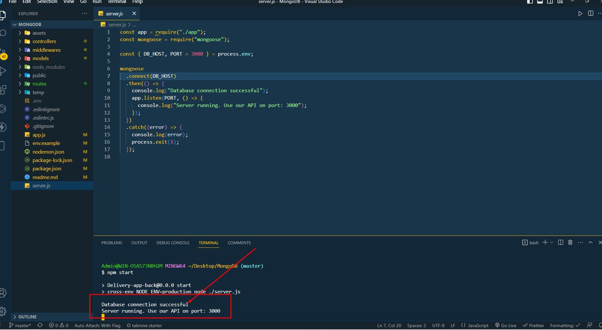
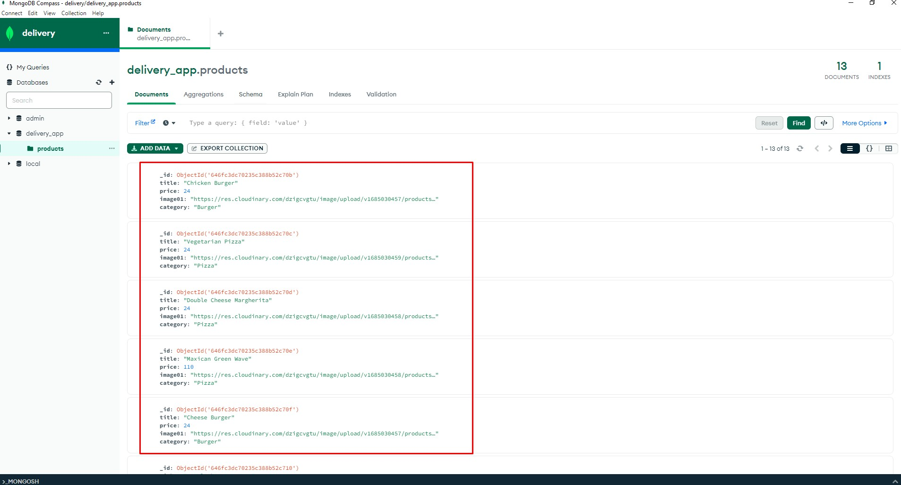
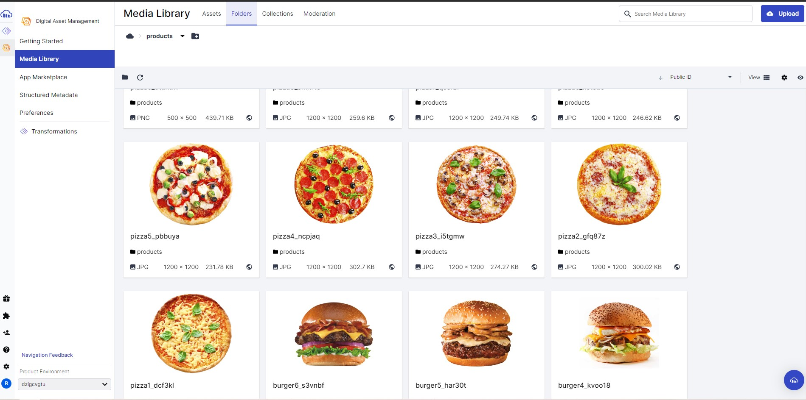
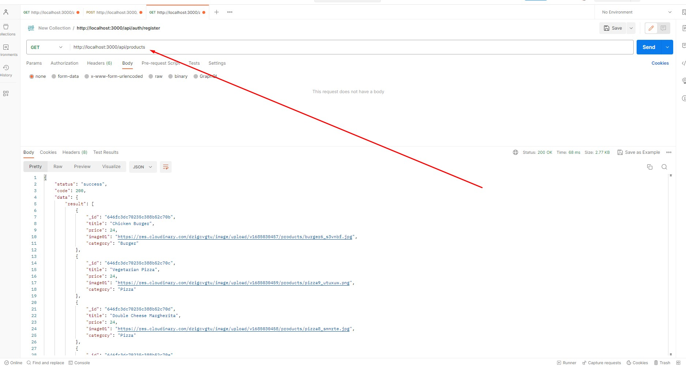
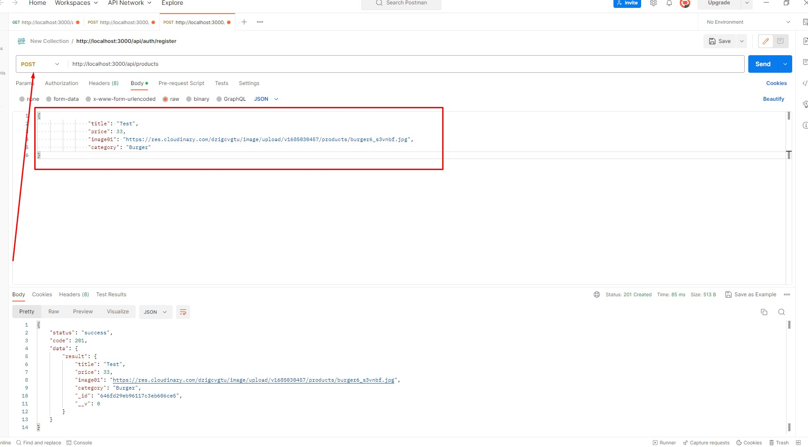
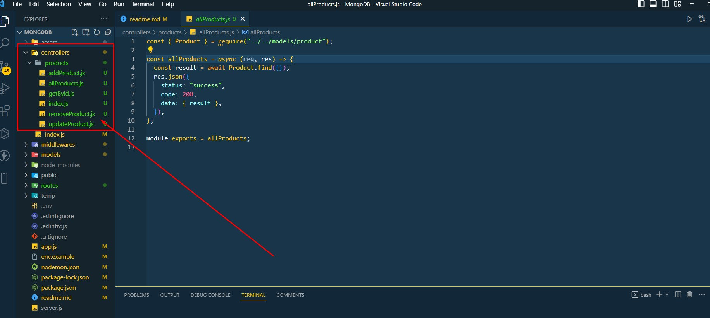

### Команди:

- `npm start` &mdash; старт сервера в режимі production
- `npm run start:dev` &mdash; старт сервера в режимі розробки (development)
- `npm run lint` &mdash; запустити виконання перевірки коду з eslint, необхідно виконувати перед кожним PR та виправляти всі помилки лінтера
- `npm lint:fix` &mdash; та ж перевірка лінтера, але з автоматичними виправленнями простих помилок

Запускаємо сервер

Дані зберігаються в MongoDB

Фото в Cloudinary

За допомогою запиту get можна отримати все меню

За допомогою запиту post додати

Також присутні інші запити які можна подивитись в контролерах

